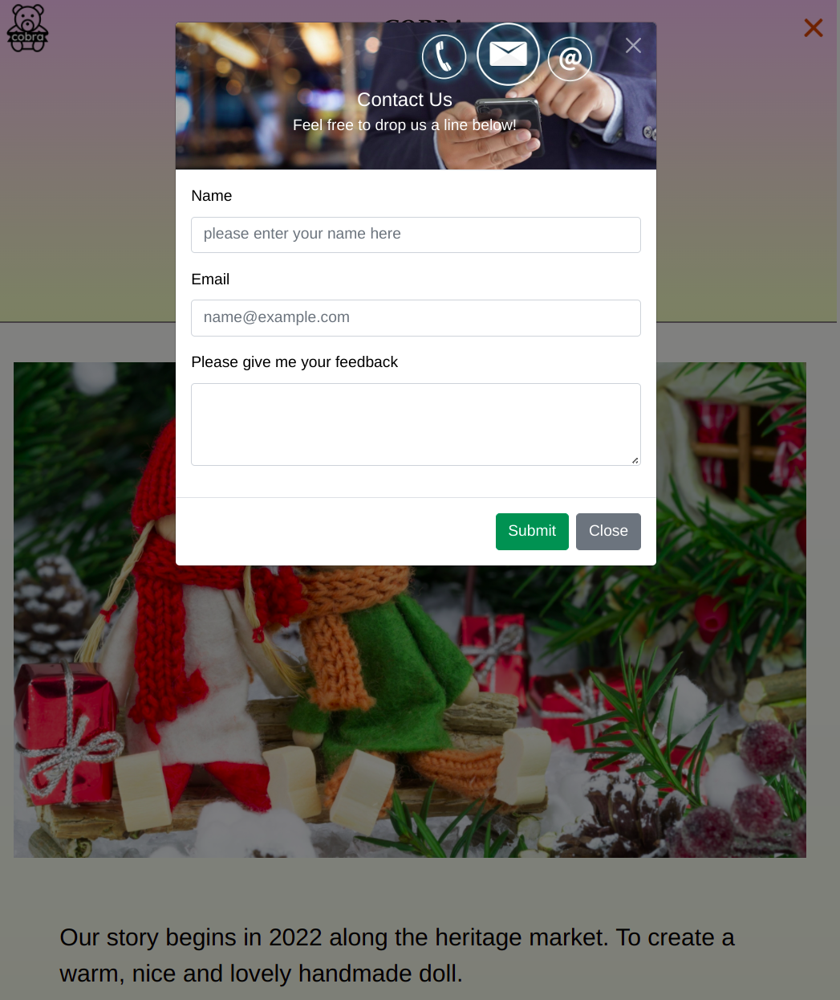

# Final Project: **Cobra**
## Project Goals and Objectives:
Implement a fully working web application with the following layers:
* Persistence: MySQL Database.
* Backend: REST API with Java and Spring Boot.
* Frontend: JavaScript + CSS + HTML.
## Stakeholders and Roles:
##### Team Lead: **Rick Yeo**
* Responsible for the project's:
  * About Us page design.
  * project and the team, and the project's scope.
  * progress tracking.
  * schedule and deadlines.
  * team daily standup.
  * website deployment.
##### Team Member: Willy Wang
* Responsible for the project's:
  * Header, Footer & Form Designer.
  * frontend and backend connections.
  * code review process.
  * team's communication.
  * providing expertise
##### Team Member: Faizal Jasmuri
* Responsible for the project's: 
  * Home page design.
  * contributing to overall project objectives
  * completing individual deliverables
  * solve project objectives
  * provide feedback to team lead
##### Team Member: CJ Ho
* Responsible for the project's:
  * Product page design.
  * documenting the process.
  * assisting in defining the project
  * providing resources
### Metrics for measuring success:
* **Business performance metrics**
  * Revenue
  * Customer satisfaction
  * Product quality
  * Product availability
  * ROI indicators
  * Productivity
* **Sales performance metrics**
  * Sales volume
  * Sales growth
  * Sales success
  * Sales quality
  * Sales effectiveness
* **Project management performance metrics** 
  * Project success
  * Project quality and satisfaction
  * Project schedule
  * Project cost
  * Scope of work
  * Gross margin
* **Employee performance metrics**
  * Productivity
  * Work quantity
  * Work quality
  * Efficiency  
### Timeline
* Week 2
  * We are assigned by random to work in groups of 3-4 people by the instructor.
* This project has 11 tasks divided into 3 Sprints. 
  * Week 3 - Sprint 1: Task 1-3
  * Week 6 - Sprint 2: Task 4-6
  * Week 9 - Sprint 3: Task 7-11
* Each Sprint will have a demo and a retrospective at the end following the Scrum methodology.
* At the end of the project, we will do a final project presentation to the entire class and potentially to a group of guests.
### Deadline
* Deployment: Wednesday, March 23rd, 2022
* Presentation: Wednesday, March 30th, 2022
### Links
  > Live demo: [_Cobra_] https://finalprojectcobra.herokuapp.com/ 
## Table of Contents
* [General Info](#general-information)
* [Technologies Used](#technologies-used)
* [Features](#features)
* [Screenshots](#screenshots)
* [Project Status](#project-status)
* [Room for Improvement](#room-for-improvement)
* [Acknowledgements](#acknowledgements)
* [Contact](#contact)
<!-- * [License](#license) -->

## General Information
* Cobra is a simple website that is being developed to improve the shopping experience for eCommerce websites. 
* It will allow the users to input their desired product and search for similar products. 
* Cobra will be free to use and does not have any in-app purchases. 
* If the user finds a handcrafted product they want to purchase, they can add to cart, checkout with their shipping information or contact us for made-to-order experience. 
#### What problem does it (intend to) solve?
* the ease of purchasing products and services over the internet
* give consumers access to a much wider range of products and prices than they would normally be able to find in their local stores.
* allows global buyers and sellers to do business in a seamless and easy way.
#### What is the purpose of your project?
  * This project is our Junior Full Stack Development (JFSD) Boot Camp's final project involves implementing 3 main layers - frontend, backend, and persistence. 
  * The frontend layer will be responsible for the design and implementation of the website.
  * The backend layer will be responsible for the REST API and the database.
  * The persistence layer will be responsible for the database.
<!-- You don't have to answer all the questions - focus the ones relevant to your project. -->

## Technologies Used
* Semantic HTML5 markup
* CSS custom properties
* Bootstrap
* Mobile-first workflow
* Java
* Spring Boot
* mySQL
* Heroku

## Features
Users should be enjoyed to:

* User-Friendly
  1. This comes from the old K.I.S.S. adage about keeping it simple.

* Mobile-Friendly Website
  1. With a responsive website, content intuitively adapts to whatever device is accessing it to provide the most user-friendly experience.

* High-Resolution Photos
  1. Gone are the days of posting one photo with a few bullet points and a price tag.
  2. Users should to be able to zoom in and get a feel for the product.  

* Special Offers
  1. Users should be able to see special offers that are available for a limited time.
  2. Users should be able to see the special offer and the product that is being offered.
  3. Users should be able to see the responsive effects with CSS Gradients and CSS Animations.

* Home.html 
**(IMPORTANT for ii, iii, iv, v, will display different kind of product)**
  1. Carousel
  2. New Product – Display latest 10 product that enter ( last 10 from database )
  3. Best Selling – Display top 10 bestselling product ( 10 lowest Price from database )
  4. Top rated – Display top 10 top rate product ( 10 item from database in idColor Desc )
  5. Sale 50% – Display discounted item. ( display item from database where idCharacter id =14,17 )
  6. Masonry item – Random 13 item from Database  

* AddProduct Page
  1. Users should be able to see product details to explain what your product is when they click on the product
  2. Color – Read from database, add and delete to/from database. Duplicate color does not allow. Cannot be delete If link with product.
  3. Character – Read from database, add and delete to/from database. Cannot be delete If link with product.
  4. Custom empty verification 
  5. File – picture will be shown after select a file

* Search
  1. Users should be able to search for products by name, category, or price.

* About Us Page 
  1. Users should be able to see the About Us page.

* ContactUs Page
  1. Users should be able to contact us.  

* Login Page
  1. Allow user to login

* Product Page 
  1. Sort – product can be display in different kind of method. ( all done in Java using sort method )
  2. Filter by color – read from database by idColor
  3. Filter by character - read from database by idCharacter
  4. Search – search keyword from database where name, description, character, color or price contain the keyword.
  5. Display detail
  6. Add to Cart – item can add to cart, ( We are using sessionStorage to store cart item.
  7. Display cart – display all item in cart, with picture, name, price, QTY ( can be modify ) remove. 

## Screenshots

<!-- If you have screenshots you'd like to share, include them here. -->
## Project Status
Project is: _in progress_ 
We expected in near future with plans for the product continuous maintenance after current minimal viable product (MVP) release and shall be updated periodically. All contributors interested are welcome to contribute.

## Room for Improvement

<!-- Include areas you believe need improvement / could improved. Also add TODOs for future development.

Room for improvement:

* Improvement to do 1
* Improvement to do 2

To do:

* Feature to be add 1
* Feature to be add 2 -->

## Acknowledgements

* This project based on [Java Full Stack Development (JFSD) Tutorial](https://drive.google.com/drive/folders/1bZ5LG-sr2IrRN70woa5-yVF_WBHIOfFW?usp=sharing).
* Million thanks to:
  * Jean Looi, our Lecturer for this Bootcamp
  * the wonderful team from Generation Singapore
  * every single marvelous talented course mate of JFSD Cohort 4
  * Rick Yeo, our team lead
  * Willy Wang, our team member
  * Faizal Jasmuri, our team member

  for their hard work and support.

## Author

Created by [CJ Ho's Linkedin](https://www.linkedin.com/in/cj-ho/) - feel free to contact me!
